# Agent Evaluation Assistant

**Production-ready evaluation infrastructure for AI agents with one-line integration.**

## Overview

A Python SDK and Terraform infrastructure for comprehensive agent evaluation with minimal code changes. Get structured logging, performance tracing, metrics dashboards, dataset collection, and quality testing by adding a single line of code.

### Key Features

- **One-Line Integration**: `enable_evaluation(agent, project_id, agent_name, config)`
- **Setup Assistant**: Interactive ADK agent guides you through setup
- **Zero-Latency**: All Cloud API calls run in background threads
- **Automated Observability**: Logs, traces, metrics, and datasets captured automatically
- **Production-Ready**: Built on GCP services (Cloud Logging, Trace, Monitoring, BigQuery)
- **Quality Evaluation**: Vertex AI Gen AI Evaluation Service for automated and model-based metrics
- **Infrastructure as Code**: Reproducible Terraform deployment
- **Flexible Configuration**: Enable/disable services and tune performance
## How the Assistant Works

The interactive setup assistant guides you through the entire configuration process:

```mermaid
flowchart TD
    Start([User Runs Assistant]) --> ModeSelect{Select Mode}
    
    ModeSelect -->|1. Full Setup| GetPaths[Get Paths:<br/>• AEA repo path<br/>• Agent project path]
    ModeSelect -->|2. Evaluation Script Only| GetAgentPath2[Get Agent Project Path]
    ModeSelect -->|3. Inquiries| Inquire[Answer Questions<br/>& Troubleshoot]
    
    GetPaths --> Explore1[Explore Project:<br/>• List directories<br/>• Find Python files<br/>• Scan imports]
    Explore1 --> CheckCompat[Check Compatibility:<br/>Scan all .py files<br/>for ADK/Custom patterns]
    
    CheckCompat -->|Compatible| AskSDK{Enable SDK<br/>Integration?}
    CheckCompat -->|Not Compatible| ShowReq[Show Requirements:<br/>• ADK: Agent + Runner<br/>• Custom: generate_content]
    ShowReq --> Exit1([Exit - Fix Agent])
    
    AskSDK -->|Yes| CopySDK[Copy SDK to<br/>Agent Project]
    AskSDK -->|No| SkipSDK[Skip SDK Integration]
    
    CopySDK --> AskEval{Enable<br/>Evaluation?}
    SkipSDK --> AskEval
    
    AskEval -->|Yes| CreateConfig[Create eval_config.yaml<br/>with all sections]
    AskEval -->|No| CreateMinConfig[Create eval_config.yaml<br/>without genai_eval/regression]
    
    CreateConfig --> ShowIntegration[Show Integration Code:<br/>• Import wrapper<br/>• Wrap agent<br/>• Multi-file guidance]
    CreateMinConfig --> ShowIntegration
    
    ShowIntegration --> AskInfra{Setup<br/>Infrastructure?}
    
    AskInfra -->|Yes| CopyTerraform[Copy Terraform<br/>to Agent Project]
    AskInfra -->|No| SkipInfra[Skip Infrastructure]
    
    CopyTerraform --> ShowTfCmd[Show Commands:<br/>• terraform init<br/>• terraform plan<br/>• terraform apply]
    SkipInfra --> ShowTfCmd
    
    ShowTfCmd --> AskEvalScript{Generate<br/>Evaluation Script?}
    
    AskEvalScript -->|Yes| GenScript[Generate run_evaluation.py:<br/>• ADK or Custom template<br/>• Project-specific config]
    AskEvalScript -->|No| Complete1
    
    GenScript --> Complete1([✅ Setup Complete!])
    
    GetAgentPath2 --> Explore2[Explore & Check<br/>Compatibility]
    Explore2 --> CheckSDK{SDK Already<br/>Integrated?}
    
    CheckSDK -->|No| ShowSDKSteps[Show SDK Integration<br/>Instructions]
    CheckSDK -->|Yes| CheckConfig{eval_config.yaml<br/>exists?}
    
    ShowSDKSteps --> CheckConfig
    
    CheckConfig -->|No| CreateConfig2[Create eval_config.yaml]
    CheckConfig -->|Yes| UpdateConfig[Update config:<br/>Add genai_eval + regression]
    
    CreateConfig2 --> GenScript2[Generate Evaluation Script]
    UpdateConfig --> GenScript2
    GenScript2 --> Complete2([✅ Script Ready!])
    
    Inquire --> QType{Question Type}
    QType -->|Config| ExplainConfig[Explain Configuration<br/>Options & Best Practices]
    QType -->|Integration| ShowIntegrationHelp[Show Integration<br/>Patterns & Examples]
    QType -->|Infrastructure| CheckInfra[Check Terraform<br/>Status & Resources]
    QType -->|Troubleshooting| Debug[Investigate Issues:<br/>• Read logs<br/>• Check setup<br/>• Suggest fixes]
    
    ExplainConfig --> Complete3([Answer Provided])
    ShowIntegrationHelp --> Complete3
    CheckInfra --> Complete3
    Debug --> Complete3
    
    style Start fill:#e1f5ff
    style Complete1 fill:#c8e6c9
    style Complete2 fill:#c8e6c9
    style Complete3 fill:#c8e6c9
    style Exit1 fill:#ffcdd2
    style ModeSelect fill:#fff9c4
    style AskSDK fill:#fff9c4
    style AskEval fill:#fff9c4
    style AskInfra fill:#fff9c4
    style AskEvalScript fill:#fff9c4
```



**Key Features:**
- 🔍 **Intelligent Discovery** - Scans entire project (up to 4 levels deep) to find agent code
- 🎯 **Flexible Patterns** - Detects ADK and Custom agents regardless of file organization
- 🛠️ **Adaptive Guidance** - Provides file-specific integration instructions for multi-file projects
- ✅ **Validation** - Verifies compatibility and checks existing setup before modifications
- 📝 **Code Generation** - Creates evaluation scripts tailored to your agent type and structure

## 🚀 Quick Start

### 1. Clone & Install SDK (Separate from Your Agent)

Clone this repo **outside** your agent project directory:

```bash
cd ~/repos  # or wherever you keep repositories
git clone https://github.com/AhmedYEita/agent-evaluation-assistant
cd agent-evaluation-assistant
pip install -e ./sdk
```

**Important:** Keep the SDK repo **separate** from your agent project:
```
~/repos/
├── agent-evaluation-assistant/     # ← SDK repo (clone here)
└── my-agent-project/           # ← Your agent (existing project)
```

### 2. Run Setup Assistant (Recommended)

```bash
cd assistant/agent
pip install -r requirements.txt

# Set your GCP project (required for the assistant)
export GOOGLE_CLOUD_PROJECT="your-gcp-project-id"
export GOOGLE_CLOUD_REGION="us-central1"

python assistant_agent.py
```

The assistant will guide you through:
- ✅ Getting your agent project path
- ✅ Verifying agent compatibility
- ✅ Generating configuration files **in your project**
- ✅ Setting up Terraform infrastructure **in your project**
- ✅ Showing integration code

### 3. Enable Evaluation

```python
from agent_evaluation_sdk import enable_evaluation

agent = YourAgent(...)
wrapper = enable_evaluation(agent, "your-gcp-project-id", "agent-name", "eval_config.yaml")
```

That's it! Your agent now has full observability.

## What You Get

### Automatic Monitoring
- ✅ **Cloud Logging** - Every interaction logged with interaction_id, input, output, duration
- ✅ **Cloud Trace** - Nested spans show LLM calls, processing time, tool usage
- ✅ **Cloud Monitoring** - Pre-built dashboard with latency, errors, token usage
- ✅ **Dataset Collection** - Optional auto-capture to BigQuery for testing

### Quality Testing
- 🧪 **Regression Testing** - Test against historical dataset
- 📊 **Automated Metrics** - BLEU, ROUGE scores
- 🎯 **Model-Based Criteria** - Coherence, fluency, safety, groundedness
- 📈 **Performance Tracking** - Compare test runs over time

## Repository Structure

```
├── sdk/                    # Python SDK (pip install -e ./sdk)
├── assistant/              # Interactive setup assistant
├── terraform/              # GCP infrastructure (BigQuery, Logging, Monitoring)
├── example_agents/         # Working examples (custom + ADK agents)
├── README.md              # This file - Overview & quick start
├── SETUP.md               # Detailed setup & deployment guide
└── CONTRIBUTING.md        # Development guidelines
```

## Documentation

Each file has a specific focus:

- **[SETUP.md](./SETUP.md)** - Complete setup guide (GCP, Terraform, configuration, troubleshooting)
- **[ROADMAP.md](./ROADMAP.md)** - Future enhancements (ADK plugin, A2A, PyPI distribution)
- **[assistant/README.md](./assistant/README.md)** - Setup assistant usage and architecture
- **[example_agents/README.md](./example_agents/README.md)** - Running example agents
- **[sdk/README.md](./sdk/README.md)** - SDK API reference
- **[CONTRIBUTING.md](./CONTRIBUTING.md)** - Development workflow

## Architecture Decisions

**Local Assistant:** Runs locally to automate file operations, validate code, and configure infrastructure (requires filesystem access).

**Wrapper Approach:** The SDK provides an evaluation wrapper that intercepts agent calls to capture observability data while running in background threads for zero-latency performance. Works universally with ADK agents, custom agents, and can extend to other frameworks.

**Compatibility Detection:** Discovers and scans all Python files in the agent directory (up to 4 levels deep) to detect ADK or Custom agent patterns, regardless of how code is organized across files.

**Manual Setup:** Prefer not to use the assistant? See [SETUP.md](./SETUP.md#manual-setup-alternative) for step-by-step manual configuration.

## Data Flow & Evaluation Architecture

```mermaid
graph TB
    subgraph "1. Agent Runtime (Zero Latency)"
        Agent[Your Agent] --> Wrapper[Evaluation Wrapper]
        Wrapper -->|Main Thread| Response[Return Response<br/>Immediately]
        Wrapper -->|Background Threads| BG[Background<br/>Observability Tasks]
    end
    
    subgraph "2. Observability (Automatic)"
        BG --> Logger[Cloud Logging]
        BG --> Tracer[Cloud Trace]
        BG --> Metrics[Cloud Monitoring]
        BG --> Dataset[(BigQuery Dataset)]
        
        Logger --> LogData[Interaction Logs:<br/>• Input/Output<br/>• Duration<br/>• Timestamps]
        
        Tracer --> TraceData[Trace Spans:<br/>• LLM calls<br/>• Tool usage<br/>• Performance]
        
        Metrics --> MetricData[Metrics Dashboard:<br/>• Latency<br/>• Token usage<br/>• Error rates]
        
        Dataset --> DSData[Test Dataset:<br/>• Instruction<br/>• Reference<br/>• Context<br/>• Trajectory]
    end
    
    subgraph "3. Trajectory Capture"
        Wrapper -->|When include_trajectories=true| TrajCapture[Capture Tool Calls]
        TrajCapture --> TrajData[Tool Trajectory:<br/>• Tool name<br/>• Duration<br/>• Errors<br/>• Sequence]
        TrajData --> Dataset
    end
    
    subgraph "4. Evaluation Pipeline"
        Dataset --> Review[Manual Review:<br/>Set reviewed=TRUE<br/>in BigQuery]
        Review --> FetchData[Fetch Test Cases<br/>with Trajectories]
        FetchData --> RunTests[Run Agent on<br/>Test Cases]
        RunTests --> Results[(Results Table)]
        
        Results --> EvalMetrics[Automated Metrics:<br/>BLEU, ROUGE]
        Results --> EvalCriteria[Model-Based Criteria:<br/>Coherence, Fluency,<br/>Safety, Groundedness]
        Results --> TrajAnalysis[Trajectory Analysis:<br/>Tool usage stats,<br/>Performance,<br/>Error rates]
        
        EvalMetrics --> MetricsTable[(Metrics Table)]
        EvalCriteria --> MetricsTable
        TrajAnalysis --> MetricsTable
    end
    
    subgraph "5. Analysis & Monitoring"
        MetricsTable --> Compare[Compare Test Runs]
        LogData --> Debug[Debug Issues]
        TraceData --> Optimize[Optimize Performance]
        TrajAnalysis --> ToolInsights[Tool Usage Insights]
    end
    
    style Agent fill:#e3f2fd
    style Wrapper fill:#fff9c4
    style Response fill:#c8e6c9
    style BG fill:#ffe0b2
    style Dataset fill:#f3e5f5
    style Results fill:#f3e5f5
    style MetricsTable fill:#f3e5f5
    style TrajData fill:#e1bee7
```



**Key Benefits:**
- ⚡ **Zero Latency** - All cloud operations run in background threads
- 📊 **Rich Observability** - Logs, traces, metrics captured automatically  
- 🔧 **Tool Insights** - Trajectory analysis shows tool usage patterns
- 🧪 **Quality Testing** - Automated + model-based evaluation
- 📈 **Trend Analysis** - Track performance over time

## Evaluation Workflow

```bash
# 1. Enable dataset collection
# Set auto_collect: true in eval_config.yaml

# 2. Run agent to collect data
python your_agent.py --test

# 3. Review & update reference answers in BigQuery
# Set reviewed=TRUE after verification

# 4. Disable collection
# Set auto_collect: false in eval_config.yaml

# 5. Run evaluation
python run_evaluation.py
```

## Technical Stack

- **Framework**: Google ADK (Agent Development Kit)
- **Infrastructure**: Terraform + GCP (Logging, Trace, Monitoring, BigQuery, Vertex AI)
- **Language**: Python 3.12+
- **CI/CD**: GitHub Actions
