# Agent Evaluation Assistant

**Production-ready evaluation infrastructure for AI agents with one-line integration.**

## 🚀 Quick Start

### 1. Clone & Install SDK

Clone anywhere - **inside or outside** your agent project:

```bash
git clone https://github.com/AhmedYEita/agent-evaluation-assistant
cd agent-evaluation-assistant
pip install -e ./sdk
```

### 2. Run Setup Assistant (Recommended)

```bash
cd assistant/agent
pip install -r requirements.txt

# Set your GCP project (required for the assistant)
export GOOGLE_CLOUD_PROJECT="your-gcp-project-id"
export GOOGLE_CLOUD_REGION="us-central1"

python assistant_agent.py
```

**The assistant will:**
- 🔍 **Intelligent Discovery** - Scans all Python files (up to 4 levels deep) to detect agent patterns
- 🎯 **Auto-Detect Agent Type** - Identifies ADK or Custom agent patterns
- 📝 **Generate Configs** - Creates `eval_config.yaml` and `run_evaluation.py` tailored to your agent
- 🏗️ **Copy Infrastructure** - Deploys Terraform modules directly to your project
- 💡 **Provide Integration Code** - Shows exact snippets for your specific agent structure
- ✅ **Validate Changes** - Checks correctness of the applied changes

### 3. Integrate & Deploy

Follow the assistant's guidance to:

```python
# 1. Add to your agent code (assistant provides exact snippet)
from agent_evaluation_sdk import enable_evaluation

agent = YourAgent(...)
wrapper = enable_evaluation(agent, "your-gcp-project-id", "agent-name", "eval_config.yaml")

# 2. Deploy infrastructure (assistant copies terraform to your project)
# cd terraform && terraform init && terraform apply
```

That's it! Your agent now has full observability.

## Overview

A Python SDK and Terraform infrastructure for comprehensive agent evaluation with minimal code changes. Get structured logging, performance tracing, metrics dashboards, dataset collection, and quality testing by adding a single line of code.

### Key Features

- **One-Line Integration**: `enable_evaluation(agent, project_id, agent_name, config)`
- **Setup Assistant**: 3 modes - full setup, evaluation only, or troubleshooting ([see workflow](./assistant/README.md#how-the-assistant-works))
- **Zero-Latency**: All Cloud API calls run in background threads
- **Automated Observability**: Logs, traces, metrics, and datasets captured automatically
- **Production-Ready**: Built on GCP services (Cloud Logging, Trace, Monitoring, BigQuery)
- **Quality Evaluation**: Computational metrics (BLEU, ROUGE) + LLM-as-Judge criteria
- **Infrastructure as Code**: Reproducible Terraform deployment
- **Flexible Configuration**: Enable/disable services and tune performance

## What You Get

### Automatic Monitoring
- ✅ **Cloud Logging** - Every interaction with context (interaction_id, input, output, duration)
- ✅ **Cloud Trace** - Performance breakdown (LLM calls, tool usage, processing time)
- ✅ **Cloud Monitoring** - Pre-built dashboard (latency, errors, token usage)
- ✅ **Dataset Collection** - Auto-capture interactions → BigQuery test cases

### Quality Testing
- 🧪 **Regression Testing** - Run agent on historical test cases
- 📊 **Computational Metrics** - BLEU, ROUGE scores for response quality
- 🎯 **LLM-as-Judge** - Model evaluates coherence, fluency, safety, groundedness
- 🔧 **Trajectory Analysis** - Tool usage patterns, timing, error rates
- 📈 **Performance Tracking** - Compare test runs over time

### Data Flow & Evaluation Architecture
## How It Works



```mermaid
graph TB
    subgraph "1. Agent Runtime (Zero Latency)"
        Agent[Your Agent] --> Wrapper[Evaluation Wrapper]
        Wrapper -->|Main Thread| Response[Return Response<br/>Immediately]
        Wrapper -->|Background Threads| BG[Background<br/>Observability Tasks]
    end
    
    subgraph "2. Observability (Automatic)"
        BG --> Logger[Cloud Logging]
        BG --> Tracer[Cloud Trace]
        BG --> Metrics[Cloud Monitoring]
        BG --> Dataset[(BigQuery Dataset)]
        
        Logger --> LogData[Interaction Logs:<br/>• Input/Output<br/>• Duration<br/>• Timestamps]
        
        Tracer --> TraceData[Trace Spans:<br/>• LLM calls<br/>• Tool usage<br/>• Performance]
        
        Metrics --> MetricData[Metrics Dashboard:<br/>• Latency<br/>• Token usage<br/>• Error rates]
        
        Dataset --> DSData[Test Dataset:<br/>• Instruction<br/>• Reference<br/>• Context<br/>• Trajectory]
    end
    
    subgraph "3. Trajectory Capture"
        Wrapper -->|When include_trajectories=true| TrajCapture[Capture Tool Calls]
        TrajCapture --> TrajData[Tool Trajectory:<br/>• Tool name<br/>• Duration<br/>• Errors<br/>• Sequence]
        TrajData --> Dataset
    end
    
    subgraph "4. Evaluation Pipeline"
        Dataset --> Review[Manual Review:<br/>Set reviewed=TRUE<br/>in BigQuery]
        Review --> FetchData[Fetch Test Cases<br/>with Trajectories]
        FetchData --> RunTests[Run Agent on<br/>Test Cases]
        RunTests --> Results[(Results Table)]
        
        Results --> EvalMetrics[Automated Metrics:<br/>BLEU, ROUGE]
        Results --> EvalCriteria[Model-Based Criteria:<br/>Coherence, Fluency,<br/>Safety, Groundedness]
        Results --> TrajAnalysis[Trajectory Analysis:<br/>Tool usage stats,<br/>Performance,<br/>Error rates]
        
        EvalMetrics --> MetricsTable[(Metrics Table)]
        EvalCriteria --> MetricsTable
        TrajAnalysis --> MetricsTable
    end
    
    subgraph "5. Analysis & Monitoring"
        MetricsTable --> Compare[Compare Test Runs]
        LogData --> Debug[Debug Issues]
        TraceData --> Optimize[Optimize Performance]
        TrajAnalysis --> ToolInsights[Tool Usage Insights]
    end
    
    style Agent fill:#e3f2fd
    style Wrapper fill:#fff9c4
    style Response fill:#c8e6c9
    style BG fill:#ffe0b2
    style Dataset fill:#f3e5f5
    style Results fill:#f3e5f5
    style MetricsTable fill:#f3e5f5
    style TrajData fill:#e1bee7
```

**Key Benefits:**
- ⚡ **Zero Latency** - All cloud operations run in background threads
- 📊 **Rich Observability** - Logs, traces, metrics captured automatically
- 📦 **Auto-Capture Datasets** - Production interactions → test cases in BigQuery
- 🔧 **Tool Insights** - Trajectory analysis shows tool usage patterns
- 🧪 **Quality Testing** - Computational metrics (BLEU, ROUGE) + LLM-as-Judge criteria
- 📈 **Trend Analysis** - Track performance over time

## Evaluation Workflow

```bash
# 1. Enable dataset collection
# Set auto_collect: true in eval_config.yaml

# 2. Run agent to collect data
python your_agent.py --test

# 3. Review & update reference answers in BigQuery
# Set reviewed=TRUE after verification

# 4. Disable collection
# Set auto_collect: false in eval_config.yaml

# 5. Run evaluation
python run_evaluation.py
```

## Repository Structure

```
├── sdk/                    # Python SDK (pip install -e ./sdk)
├── assistant/              # Interactive setup assistant
├── terraform/              # GCP infrastructure (BigQuery, Logging, Monitoring)
├── example_agents/         # Working examples (custom + ADK agents)
├── README.md              # This file - Overview & quick start
├── SETUP.md               # Detailed setup & deployment guide
└── CONTRIBUTING.md        # Development guidelines
```

## Technical Stack

- **Framework**: Google ADK (Agent Development Kit)
- **Infrastructure**: Terraform + GCP (Logging, Trace, Monitoring, BigQuery, Vertex AI)
- **Language**: Python 3.12+
- **CI/CD**: GitHub Actions

---

## Architecture & Design

### Architecture Decisions

**Local Assistant:** Runs locally to automate file operations, validate code, and configure infrastructure (requires filesystem access).

**Wrapper Approach:** The SDK provides an evaluation wrapper that intercepts agent calls to capture observability data while running in background threads for zero-latency performance. Works universally with ADK agents, custom agents, and can extend to other frameworks.

**Compatibility Detection:** Discovers and scans all Python files in the agent directory (up to 4 levels deep) to detect ADK or Custom agent patterns, regardless of how code is organized across files.

**Manual Setup:** Prefer not to use the assistant? See [SETUP.md](./SETUP.md#manual-setup-alternative) for step-by-step manual configuration.

---

## Documentation

- **[SETUP.md](./SETUP.md)** - Complete setup guide (GCP, Terraform, configuration, troubleshooting)
- **[assistant/README.md](./assistant/README.md)** - Setup assistant usage and architecture
- **[sdk/README.md](./sdk/README.md)** - SDK API reference
- **[example_agents/README.md](./example_agents/README.md)** - Running example agents
- **[ROADMAP.md](./ROADMAP.md)** - Future enhancements (A2A, PyPI distribution)
- **[CONTRIBUTING.md](./CONTRIBUTING.md)** - Development workflow
