# Setup Assistant

Interactive ADK-based agent that guides you through setting up agent evaluation infrastructure.

## How the Assistant Works

The assistant operates in **3 modes** and intelligently adapts to your project structure:

```mermaid
flowchart TD
    Start([User Runs Assistant]) --> ModeSelect{Select Mode}
    
    ModeSelect -->|1. Full Setup| GetPaths[Get Paths:<br/>• AEA repo path<br/>• Agent project path]
    ModeSelect -->|2. Evaluation Script Only| GetAgentPath2[Get Agent Project Path]
    ModeSelect -->|3. Inquiries| Inquire[Answer Questions<br/>& Troubleshoot]
    
    GetPaths --> Explore1[Explore Project:<br/>• List directories<br/>• Find Python files<br/>• Scan imports]
    Explore1 --> CheckCompat[Check Compatibility:<br/>Scan all .py files<br/>for ADK/Custom patterns]
    
    CheckCompat -->|Compatible| AskSDK{Enable SDK<br/>Integration?}
    CheckCompat -->|Not Compatible| ShowReq[Show Requirements:<br/>• ADK: Agent + Runner<br/>• Custom: generate_content]
    ShowReq --> Exit1([Exit - Fix Agent])
    
    AskSDK -->|Yes| CopySDK[Copy SDK to<br/>Agent Project]
    AskSDK -->|No| SkipSDK[Skip SDK Integration]
    
    CopySDK --> AskEval{Enable<br/>Evaluation?}
    SkipSDK --> AskEval
    
    AskEval -->|Yes| CreateConfig[Create eval_config.yaml<br/>with all sections]
    AskEval -->|No| CreateMinConfig[Create eval_config.yaml<br/>without genai_eval/regression]
    
    CreateConfig --> ShowIntegration[Show Integration Code:<br/>• Import wrapper<br/>• Wrap agent<br/>• Multi-file guidance]
    CreateMinConfig --> ShowIntegration
    
    ShowIntegration --> AskInfra{Setup<br/>Infrastructure?}
    
    AskInfra -->|Yes| CopyTerraform[Copy Terraform<br/>to Agent Project]
    AskInfra -->|No| SkipInfra[Skip Infrastructure]
    
    CopyTerraform --> ShowTfCmd[Show Commands:<br/>• terraform init<br/>• terraform plan<br/>• terraform apply]
    SkipInfra --> ShowTfCmd
    
    ShowTfCmd --> AskEvalScript{Generate<br/>Evaluation Script?}
    
    AskEvalScript -->|Yes| GenScript[Generate run_evaluation.py:<br/>• ADK or Custom template<br/>• Project-specific config]
    AskEvalScript -->|No| Complete1
    
    GenScript --> Complete1([✅ Setup Complete!])
    
    GetAgentPath2 --> Explore2[Explore & Check<br/>Compatibility]
    Explore2 --> CheckSDK{SDK Already<br/>Integrated?}
    
    CheckSDK -->|No| ShowSDKSteps[Show SDK Integration<br/>Instructions]
    CheckSDK -->|Yes| CheckConfig{eval_config.yaml<br/>exists?}
    
    ShowSDKSteps --> CheckConfig
    
    CheckConfig -->|No| CreateConfig2[Create eval_config.yaml]
    CheckConfig -->|Yes| UpdateConfig[Update config:<br/>Add genai_eval + regression]
    
    CreateConfig2 --> GenScript2[Generate Evaluation Script]
    UpdateConfig --> GenScript2
    GenScript2 --> Complete2([✅ Script Ready!])
    
    Inquire --> QType{Question Type}
    QType -->|Config| ExplainConfig[Explain Configuration<br/>Options & Best Practices]
    QType -->|Integration| ShowIntegrationHelp[Show Integration<br/>Patterns & Examples]
    QType -->|Infrastructure| CheckInfra[Check Terraform<br/>Status & Resources]
    QType -->|Troubleshooting| Debug[Investigate Issues:<br/>• Read logs<br/>• Check setup<br/>• Suggest fixes]
    
    ExplainConfig --> Complete3([Answer Provided])
    ShowIntegrationHelp --> Complete3
    CheckInfra --> Complete3
    Debug --> Complete3
    
    style Start fill:#e1f5ff
    style Complete1 fill:#c8e6c9
    style Complete2 fill:#c8e6c9
    style Complete3 fill:#c8e6c9
    style Exit1 fill:#ffcdd2
    style ModeSelect fill:#fff9c4
    style AskSDK fill:#fff9c4
    style AskEval fill:#fff9c4
    style AskInfra fill:#fff9c4
    style AskEvalScript fill:#fff9c4
```



**Key Capabilities:**
- 🔍 **Intelligent Discovery** - Automatically scans projects to detect agent patterns across multiple files
- 🛠️ **Adaptive Guidance** - Provides context-aware integration instructions based on your code structure
- 🎯 **Three Operating Modes** - Full setup, evaluation-only, or troubleshooting support
- ✅ **Validation First** - Checks compatibility and existing configuration before making changes
- 📝 **Code Generation** - Creates tailored evaluation scripts for ADK and custom agents

## Quick Start

### Step 1: Clone SDK Repository

Clone anywhere - works **inside or outside** your agent project:

```bash
# Option A: Clone inside your agent project
cd /path/to/your-agent-project
git clone https://github.com/AhmedYEita/agent-evaluation-assistant
cd agent-evaluation-assistant
pip install -e ./sdk

# Option B: Clone separately  
cd ~/repos
git clone https://github.com/AhmedYEita/agent-evaluation-assistant
cd agent-evaluation-assistant
pip install -e ./sdk
```

### Step 2: Run the Assistant

```bash
cd assistant/agent
pip install -r requirements.txt
export GOOGLE_CLOUD_PROJECT="your-gcp-project-id"
export GOOGLE_CLOUD_REGION="us-central1"
python assistant_agent.py
```

### Step 3: Follow the Interactive Setup

The assistant will ask for your agent project path (e.g., `~/repos/my-agent-project`) and copy the necessary files there.

## What It Does

The assistant **conversationally** guides you through:

1. ✅ Getting your agent project path
2. ✅ Checking agent compatibility (`generate_content()` or `run_async()`)
3. ✅ Configuring observability (logging, tracing, metrics)
4. ✅ Setting up dataset collection
5. ✅ Generating `eval_config.yaml` in your project
6. ✅ Copying terraform to your project
7. ✅ Showing SDK integration code with your values

## Architecture

Built with Google ADK (Agent Development Kit):
- **Model**: Gemini 2.5 Flash
- **Tools**: File operations, config validation, infrastructure checks
- **Conversational**: Adapts to your responses, not a rigid script

## Example Interaction

```
🤖 Assistant: Hi! I'll help you set up agent evaluation. Ready to start?
You: Yes
🤖 Assistant: What's the path to your agent project?
You: ~/my-agent
🤖 Assistant: What's your agent file path (with generate_content method)?
You: ~/my-agent/agent.py
🤖 Assistant: ✓ Agent compatible! Configure observability: all/logging/tracing?
You: all
🤖 Assistant: Enable dataset collection?
You: no
🤖 Assistant: What's your GCP project ID?
You: my-project-123
🤖 Assistant: ✓ Created eval_config.yaml
              ✓ Copied terraform
              
              Integrate SDK:
              wrapper = enable_evaluation(agent, "my-project-123", "my-agent", "eval_config.yaml")
              
              Deploy: cd terraform && terraform apply
```

## Files

```
assistant/agent/
├── assistant_agent.py          # Main ADK agent
├── system_instruction.prompt   # Conversation flow & personality
├── requirements.txt            # Dependencies
└── tools/
    ├── config_operations.py    # Generate configs
    ├── file_operations.py      # Copy files, check compatibility
    ├── config_validator.py     # Validate YAML
    └── infra_checker.py        # Check GCP resources
```

## Tools Available

| Tool | Purpose |
|------|---------|
| `check_agent_compatibility_tool` | Verify agent has required methods |
| `copy_config_template_tool` | Generate customized eval_config.yaml |
| `copy_terraform_module_tool` | Copy terraform to agent project |
| `validate_config_tool` | Check YAML syntax |
| `check_infrastructure_tool` | Verify GCP resources exist |

## Customization

Modify the assistant by editing:
- `system_instruction.prompt` - Conversation flow and personality
- `tools/*.py` - Add new capabilities
- `assistant_agent.py` - Change model or configuration

## FAQ

**Q: Why run locally instead of deploying?**  
A: Needs local file access to check your agent and copy configs.

**Q: Can I skip the assistant?**  
A: Yes, manually create configs and copy terraform (see main [SETUP.md](../SETUP.md)).

**Q: Use for multiple projects?**  
A: Yes, run once per project. Generates separate configs for each.

**Q: Will there be a deployed version?**  
A: The assistant requires local file access for automation. For simpler setups, we're exploring GitHub integration and PyPI distribution. See [ROADMAP.md](../ROADMAP.md) for future plans.

---

See [main README](../README.md) for complete documentation.
