# Setup Assistant

Interactive ADK-based agent that guides you through setting up agent evaluation infrastructure.

## How the Assistant Works

The assistant operates in **3 modes** and intelligently adapts to your project structure:

```mermaid
flowchart TD
    Start([User Runs Assistant]) --> ModeSelect{Select Mode}
    
    ModeSelect -->|1. Full Setup| GetPaths[Get Paths:<br/>• AEA repo path<br/>• Agent project path]
    ModeSelect -->|2. Evaluation Script Only| GetAgentPath2[Get Agent Project Path]
    ModeSelect -->|3. Inquiries| Inquire[Answer Questions<br/>& Troubleshoot]
    
    GetPaths --> Explore1[Explore Project:<br/>• List directories<br/>• Find Python files<br/>• Scan imports]
    Explore1 --> CheckCompat[Check Compatibility:<br/>Scan all .py files<br/>for ADK/Custom patterns]
    
    CheckCompat -->|Compatible| AskSDK{Enable SDK<br/>Integration?}
    CheckCompat -->|Not Compatible| ShowReq[Show Requirements:<br/>• ADK: Agent + Runner<br/>• Custom: generate_content]
    ShowReq --> Exit1([Exit - Fix Agent])
    
    AskSDK -->|Yes| CopySDK[Copy SDK to<br/>Agent Project]
    AskSDK -->|No| SkipSDK[Skip SDK Integration]
    
    CopySDK --> AskEval{Enable<br/>Evaluation?}
    SkipSDK --> AskEval
    
    AskEval -->|Yes| CreateConfig[Create eval_config.yaml<br/>with all sections]
    AskEval -->|No| CreateMinConfig[Create eval_config.yaml<br/>without genai_eval/regression]
    
    CreateConfig --> ShowIntegration[Show Integration Code:<br/>• Import wrapper<br/>• Wrap agent<br/>• Multi-file guidance]
    CreateMinConfig --> ShowIntegration
    
    ShowIntegration --> AskInfra{Setup<br/>Infrastructure?}
    
    AskInfra -->|Yes| CopyTerraform[Copy Terraform<br/>to Agent Project]
    AskInfra -->|No| SkipInfra[Skip Infrastructure]
    
    CopyTerraform --> ShowTfCmd[Show Commands:<br/>• terraform init<br/>• terraform plan<br/>• terraform apply]
    SkipInfra --> ShowTfCmd
    
    ShowTfCmd --> AskEvalScript{Generate<br/>Evaluation Script?}
    
    AskEvalScript -->|Yes| GenScript[Generate run_evaluation.py:<br/>• ADK or Custom template<br/>• Project-specific config]
    AskEvalScript -->|No| Complete1
    
    GenScript --> Complete1([✅ Setup Complete!])
    
    GetAgentPath2 --> Explore2[Explore & Check<br/>Compatibility]
    Explore2 --> CheckSDK{SDK Already<br/>Integrated?}
    
    CheckSDK -->|No| ShowSDKSteps[Show SDK Integration<br/>Instructions]
    CheckSDK -->|Yes| CheckConfig{eval_config.yaml<br/>exists?}
    
    ShowSDKSteps --> CheckConfig
    
    CheckConfig -->|No| CreateConfig2[Create eval_config.yaml]
    CheckConfig -->|Yes| UpdateConfig[Update config:<br/>Add genai_eval + regression]
    
    CreateConfig2 --> GenScript2[Generate Evaluation Script]
    UpdateConfig --> GenScript2
    GenScript2 --> Complete2([✅ Script Ready!])
    
    Inquire --> QType{Question Type}
    QType -->|Config| ExplainConfig[Explain Configuration<br/>Options & Best Practices]
    QType -->|Integration| ShowIntegrationHelp[Show Integration<br/>Patterns & Examples]
    QType -->|Infrastructure| CheckInfra[Check Terraform<br/>Status & Resources]
    QType -->|Troubleshooting| Debug[Investigate Issues:<br/>• Read logs<br/>• Check setup<br/>• Suggest fixes]
    
    ExplainConfig --> Complete3([Answer Provided])
    ShowIntegrationHelp --> Complete3
    CheckInfra --> Complete3
    Debug --> Complete3
    
    style Start fill:#e1f5ff
    style Complete1 fill:#c8e6c9
    style Complete2 fill:#c8e6c9
    style Complete3 fill:#c8e6c9
    style Exit1 fill:#ffcdd2
    style ModeSelect fill:#fff9c4
    style AskSDK fill:#fff9c4
    style AskEval fill:#fff9c4
    style AskInfra fill:#fff9c4
    style AskEvalScript fill:#fff9c4
```



**Key Capabilities:**
- 🔍 **Intelligent Discovery** - Automatically scans projects to detect agent patterns across multiple files
- 🛠️ **Adaptive Guidance** - Provides context-aware integration instructions based on your code structure
- 🎯 **Three Operating Modes** - Full setup, evaluation-only, or troubleshooting support
- ✅ **Validation First** - Checks compatibility and existing configuration before making changes
- 📝 **Code Generation** - Creates tailored evaluation scripts for ADK and custom agents

## Quick Start

### Step 1: Clone SDK Repository

Clone anywhere - **inside or outside** your agent project:

```bash
git clone https://github.com/teamdatatonic/agents-in-sdlc-competition.git
cd agents-in-sdlc-competition/agent-evaluation-assistant
pip install -e ./sdk
```

### Step 2: Run the Assistant

```bash
cd assistant/agent
pip install -r requirements.txt
export GOOGLE_CLOUD_PROJECT="your-gcp-project-id"
export GOOGLE_CLOUD_REGION="us-central1"
python assistant_agent.py
```

### Step 3: Follow the Interactive Setup

The assistant adapts to your project structure and provides personalized guidance.

## What It Does

The assistant provides **3 modes of operation**:

1. **Full Setup** - Complete SDK integration + infrastructure deployment
2. **Evaluation Script Only** - Generate `run_evaluation.py` (assumes SDK already integrated)
3. **Inquiries/Troubleshooting** - Answer questions and investigate issues

**Intelligent capabilities:**
- 🔍 **Discovers your code structure** - Scans all Python files to detect ADK or custom agent patterns
- 🎯 **Generates configs in your project** - Creates `eval_config.yaml` tailored to your needs
- 🏗️ **Copies infrastructure** - Deploys Terraform modules to your project directory
- 📝 **Provides integration code** - Shows exact code snippets for your agent type
- ✅ **Validates compatibility** - Checks agent structure before making changes

## Architecture

Built with Google ADK (Agent Development Kit):
- **Model**: Gemini 2.5 Flash
- **Tools**: File operations, config validation, infrastructure checks
- **Adaptive**: Understands multi-file projects and imports

## What You Get

**For Mode 1 (Full Setup):**
- ✅ SDK copied to your project
- ✅ `eval_config.yaml` with your settings
- ✅ Terraform infrastructure in your project
- ✅ Integration code examples for your agent type
- ✅ Step-by-step deployment instructions

**For Mode 2 (Evaluation Script Only):**
- ✅ `run_evaluation.py` tailored to your agent
- ✅ Updated `eval_config.yaml` with evaluation settings
- ✅ Guidance on running regression tests

**For Mode 3 (Inquiries):**
- ✅ Answers about configuration options
- ✅ Troubleshooting guidance
- ✅ Infrastructure status checks

## Files

```
assistant/agent/
├── assistant_agent.py          # Main ADK agent
├── system_instruction.prompt   # Conversation flow & logic
├── requirements.txt            # Dependencies
└── tools/
    ├── config_operations.py    # Generate configs
    ├── file_operations.py      # Discover & check compatibility
    ├── evaluation_script_generation.py  # Generate evaluation scripts
    ├── config_validator.py     # Validate YAML
    ├── terraform_operations.py # Copy infrastructure
    └── infra_checker.py        # Check GCP resources
```

## Tools Available

| Tool | Purpose |
|------|---------|
| `list_directory_tool` | Explore project structure |
| `read_file_tool` | Read agent files and imports |
| `check_agent_compatibility_tool` | Scan all Python files for agent patterns |
| `copy_config_template_tool` | Generate customized eval_config.yaml |
| `generate_evaluation_script_tool` | Create run_evaluation.py for your agent |
| `copy_terraform_module_tool` | Copy terraform to agent project |
| `validate_config_tool` | Check YAML syntax |
| `check_infrastructure_tool` | Verify GCP resources exist |

## Customization

Modify the assistant by editing:
- `system_instruction.prompt` - Conversation flow and personality
- `tools/*.py` - Add new capabilities
- `assistant_agent.py` - Change model or configuration

## FAQ

**Q: Why run locally instead of deploying?**  
A: Needs local file access to check your agent and copy configs.

**Q: Can I skip the assistant?**  
A: Yes, manually create configs and copy terraform (see main [SETUP.md](../SETUP.md)).

**Q: Use for multiple projects?**  
A: Yes, run once per project. Generates separate configs for each.

**Q: Will there be a deployed version?**  
A: The assistant requires local file access for automation. For simpler setups, we're exploring GitHub integration and PyPI distribution. See [ROADMAP.md](../ROADMAP.md) for future plans.

---

See [main README](../README.md) for complete documentation.
